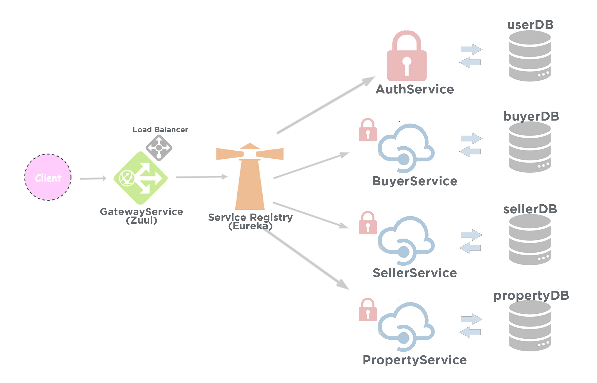

# P G Wala

A Web App to search accommodation (PG, Hostel, Shared Living Space), especially for those who works or studies at far away places from their home.

## Demo

## Built With

* Java 11
* Spring
* Angular
* MongoDB

## Microservice Architecture of P G Wala

* GatewayService

A point of contact for all User Interfaces. A Client can access all APIs via GatewayService. It has Zuul dependency which acts as a Gateway and has Netflix Ribbon Load Balancer (Client Side Load Balancer)

* DiscoveryService

A Service Registry which has all others Services (with all instances) registered with it. RestTemplate calls between any Microservices are served by DiscoveryService.

* AuthService

A service to handle Login and Register requests. Login request generates a valid JWT Token which can be used to access related protected APIs. Register request creates a new user for the App.

* BuyerService

A Buyer is a person who wants to consume Services provided by the Vendors (Property Owners). BuyerService has all Buyer related endpoints (profile page, change password). A Buyer is able to access some APIs if it brings valid JWT Token from AuthService.

* SellerService

A Seller is a person who wants to use the app to display Real Estates and earn customers . SellerService has all related endpoints (add, view, modify - properties). SellerService has some protected API endpoints which can be accessed if it brings a vlid JWT Token from AuthService.

* PropertyService

A service using which all Seller's Property related data can be managed. Add, Delete, Modify, View activities on Property data can be done using PropertyService. There are some public endpoints as well as protected endpoints available with PropertyService.